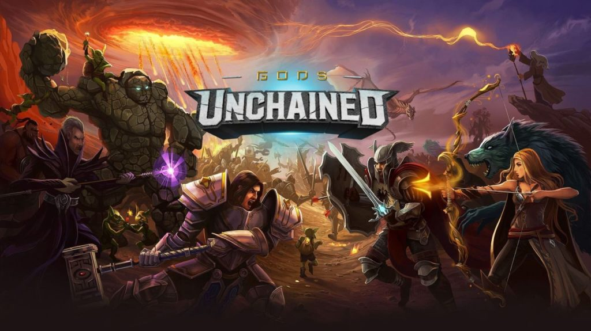

# Gods Unchained Cards Analyzer
Uma API que classifica a estratégia de um card a partir de seus atributos.

</img>

## Motivação
Recentemente encontramos um jogo de cartas chamado [Gods Unchained](https://godsunchained.com/) e decidimos participar de um campeonato. Para nos preparar para a competição decidimos treinar um modelo de machine learning que faz a classificação das cartas a partir de seus atributos (mana, attack, health).

A classificação das cartas é feita em:
* **early**: Cards que são mais forte nos primeiros turnos do jogo.
* **late**: Cards que são mais fortes nos turnos finais do jogo.

## Instalação
Este código é executado usando Docker e Docker compose. Caso você não tenha instalado em sua máquina, você pode acessar os links abaixo que contém um guia de instalação.
* [Docker](https://docs.docker.com/get-docker/)
* [Docker Compose](https://docs.docker.com/compose/install/)

### API
A aplicação REST foi construida utilizando o framework [Fast API](https://fastapi.tiangolo.com/) e o banco de dados [MongoDB](https://www.mongodb.com/) que armazena o historico de requisições.

#### Rotas:
* **/healthcheck (GET)** - Retorna o status de saúde da API.
* **/predict (POST)** - Realiza a classificação da estratégia do Card e grava a requisição no banco de dados.
* **/cards_analyzed (GET)** - Retorna 100 registros de Cards que foram previamente classificados.

Para realizar a subida da API e do banco de dados, você deve executar.

```console
docker compose up --build
```

Após os serviços terem subido, você pode acessa-los em:
* [Cards Analyzer API](https://localhost:8000)
* [Cards Analyzer API - Swagger](https://localhost:8000/docs)

Caso você deseje desligar os serviços, você deve executar.
```console
docker compose down
```

### Testes
Para rodar os testes, você deve subir o mongo com o comando: 
```console
docker compose up mongo-database
```
No seu ambiente virtual Python, instale as dependências.
```console
pip install -r requirements.txt
```
E execute os testes
```console
pytest
```

| Conceitos | Descrição |
| --- | --- |
| SOLID | Seguimos os príncipios SOLID. Separamos o projeto por responsabilidades, permitimos que esteja aberta para evoluções, reduzindo dependências e alto acoplamento.
| TDD | Seguimos o mantra do TDD, criamos testes unitários e testes de integração.
| Repository Design Pattern | Ao utilizar esse Design pattern, separamos a responsabilidade de acesso ao banco e permitimos alterá-lo com maior facilidade.
| Docker | Nos ajudou a ter um ambiente mais rápido e confiável. |

## Licensa, Autores, e Agradecimentos.
Eric Buzato Venarusso - RM: 342225 <br>
Rafael Lino - RM: 337004 <br>
Gabriela Carvalho - RM: 340876 <br>
Lucas Vasconcelos de Carvalho - RM: 340543 <br>
